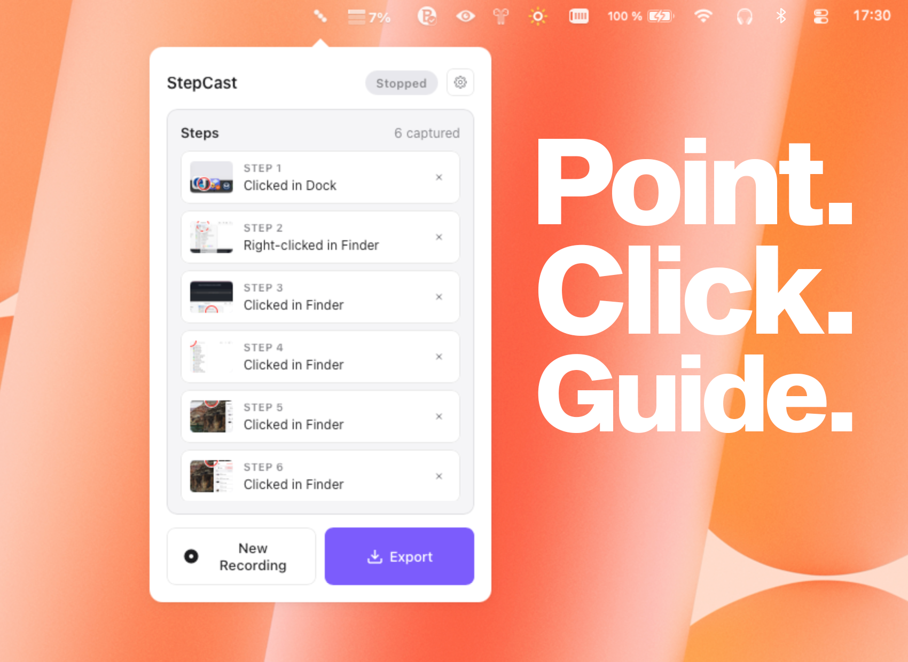

# StepCast

A lightweight macOS menu bar app that records your screen interactions step-by-step and exports them as visual guides — like Windows PSR, but for Mac.

## Download

Download the latest release from the [Releases page](https://github.com/w0nk1/StepCast/releases/latest). StepCast includes auto-updates, so you only need to download it once.

## What It Does

- Lives in your menu bar — one click to start recording
- Captures a screenshot on every click, with window and UI element context
- Export as HTML, Markdown, or PDF
- Everything stays local — no cloud, no accounts
- Anonymous usage analytics via [Aptabase](https://aptabase.com) (release builds only)

## Contributing

Contributions welcome! See [CONTRIBUTING.md](CONTRIBUTING.md) for details, or [open an issue](https://github.com/w0nk1/StepCast/issues).

## License

[MIT](LICENSE)
